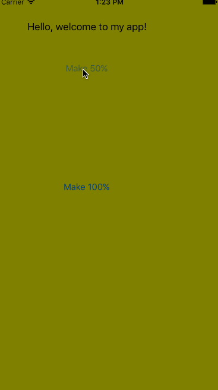

# Alpha Touch

**Alpha Touch** is an iOS app, created in Obj-C for me to learn basic concepts for header and implementation files, as well as implementing UIButtons that trigger events based on actions.

## Features

- [x] Yellow background
- [x] 2 UIButtons
- [x] 1 button changes the transparency to 50% and the other convert it back.

## Video Walkthrough

